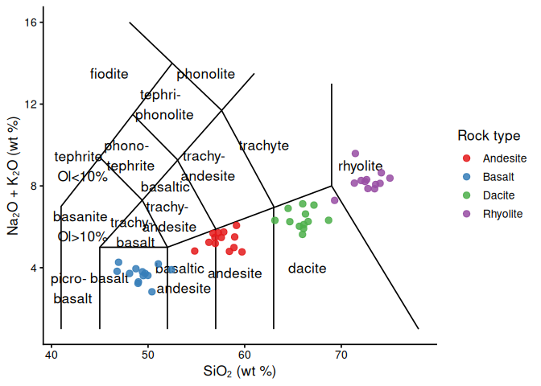
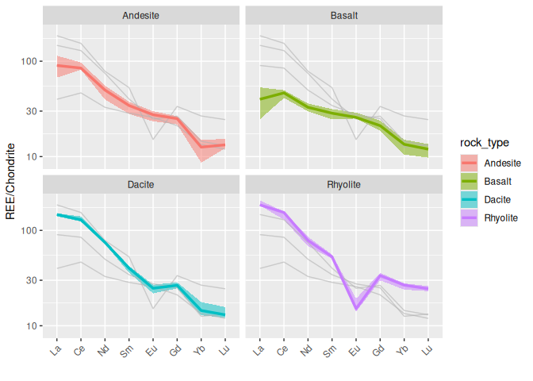
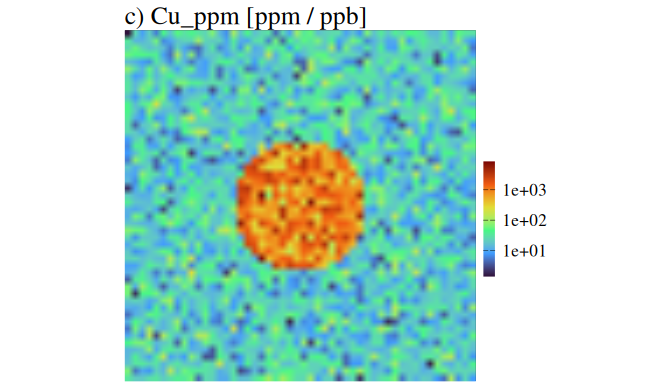

<!-- README.md is generated from README.Rmd. Please edit that file -->

# geochem

<!-- badges: start -->

<!-- badges: end -->

**geochem** is an R package for wrangling, analysing, and visualising
geochemical data, with a particular focus on Laser-ICP-MS datasets. It
provides functions for element conversion, outlier filtering,
classification diagrams, spider plots, and publication-quality laser
maps.

## Installation

The development version can be installed from
[GitHub](https://github.com/muhohl/geochem) with:

``` r
# install.packages("devtools")
devtools::install_github("muhohl/geochem")
```

## Built-in datasets

The package includes three synthetic datasets that cover the most common
geochemical workflows:

| Dataset | Description |
|----|----|
| `whole_rock_data` | 50 whole-rock analyses (Basalt / Andesite / Dacite / Rhyolite) with major oxides in wt % and trace elements in ppm |
| `laser_map_data` | 2 500-point 50 × 50 laser map with 8 element channels |
| `detection_limit_data` | 40 PGE assay rows with below-detection values stored as `"<X"` strings |

``` r
dplyr::glimpse(whole_rock_data)
#> Rows: 50
#> Columns: 30
#> $ Sample_ID <chr> "WR-001", "WR-002", "WR-003", "WR-004", "WR-005", "WR-006", …
#> $ rock_type <chr> "Basalt", "Basalt", "Basalt", "Basalt", "Basalt", "Basalt", …
#> $ SiO2      <dbl> 51.05644, 52.42997, 48.74212, 48.08661, 46.94758, 49.41483, …
#> $ TiO2      <dbl> 1.4152953, 1.2916709, 1.6822012, 1.5757433, 1.5649227, 1.601…
#> $ Al2O3     <dbl> 15.29050, 14.77697, 16.51615, 13.62639, 14.35089, 15.07187, …
#> $ Fe2O3     <dbl> 3.253145, 2.946671, 2.827812, 2.686216, 3.577641, 1.802764, …
#> $ FeO       <dbl> 7.242561, 7.381570, 6.845638, 6.489455, 6.741132, 7.170930, …
#> $ MnO       <dbl> 0.1778775, 0.1743149, 0.1447367, 0.1317158, 0.1931130, 0.172…
#> $ MgO       <dbl> 10.209218, 6.874836, 9.368078, 9.028898, 9.257540, 9.148184,…
#> $ CaO       <dbl> 9.933739, 8.291673, 9.552004, 10.144199, 9.451313, 10.407277…
#> $ Na2O      <dbl> 3.405527, 3.196034, 2.936635, 2.691683, 3.272718, 3.219921, …
#> $ K2O       <dbl> 0.7811858, 0.7080084, 1.0114512, 1.0274490, 0.9928698, 0.581…
#> $ P2O5      <dbl> 0.2521948, 0.1287477, 0.2414041, 0.1709318, 0.2035904, 0.252…
#> $ Ni        <dbl> 98.77468, 128.53247, 138.12617, 138.44641, 137.05903, 116.76…
#> $ Cu        <dbl> 84.87156, 71.43472, 58.10519, 94.81480, 83.09899, 68.33946, …
#> $ Zn        <dbl> 83.11852, 81.26718, 97.58149, 95.02682, 97.01336, 91.16246, …
#> $ Rb        <dbl> 26.777839, 11.285849, 4.535695, 11.394781, 25.474520, 8.8668…
#> $ Sr        <dbl> 380.0067, 343.7064, 342.2572, 412.5628, 324.9370, 332.0230, …
#> $ Y         <dbl> 26.20421, 21.27478, 24.99066, 18.50810, 26.58089, 28.21173, …
#> $ Zr        <dbl> 137.32028, 50.42476, 99.67926, 121.59741, 77.69580, 85.66308…
#> $ Nb        <dbl> 1.9490124, 4.5608004, 5.3038946, 3.9767945, 6.2616368, 1.143…
#> $ Ba        <dbl> 252.85740, 263.62207, 227.88089, 26.61080, 145.38359, 233.15…
#> $ La        <dbl> 4.102340, 21.386648, 11.368938, 2.670931, 14.260693, 3.98729…
#> $ Ce        <dbl> 33.87716, 28.02606, 25.51464, 30.45179, 31.67999, 14.45400, …
#> $ Nd        <dbl> 15.448211, 14.596650, 15.801637, 26.117672, 13.648063, 0.100…
#> $ Sm        <dbl> 4.773809, 4.770386, 3.653086, 4.218701, 4.372410, 4.664990, …
#> $ Eu        <dbl> 1.415762, 1.410714, 1.707482, 1.626157, 1.514871, 1.450219, …
#> $ Gd        <dbl> 3.245040, 4.152081, 2.763803, 5.170935, 4.315440, 4.869835, …
#> $ Yb        <dbl> 0.9960884, 1.1313514, 2.5135023, 1.6726924, 2.5861213, 2.422…
#> $ Lu        <dbl> 0.3324584, 0.2241783, 0.2850910, 0.3572377, 0.3835622, 0.297…
```

------------------------------------------------------------------------

## Examples

### Imputing below-detection-limit values

`Random_Number_Imputer()` replaces `"<X"` strings with a uniform random
value drawn from `[0, X]`. `Random_Number_Imputer()` searches for the
“\<” symbole and replaces the number with a random value between 0 and
that number.

``` r
dl_imputed <- Random_Number_Imputer(
  data = detection_limit_data,
  columns = 2:5,
  split_symbol = "<"
)

head(dl_imputed)
#>   Sample_ID   Au_ppb   Pd_ppb   Pt_ppb Ag_ppb
#> 1    DL-001 0.005248 0.035000 0.037111  2.542
#> 2    DL-002 0.013856 0.027026 0.065825  1.503
#> 3    DL-003 0.087000 0.500000 0.036944  1.806
#> 4    DL-004 0.032791 0.040040 0.214000  1.017
#> 5    DL-005 0.046217 0.110000 0.074987  0.831
#> 6    DL-006 0.012683 0.095921 0.706000  4.201
```

------------------------------------------------------------------------

### Converting oxides to elements

`oxides_to_elements()` converts wt % oxide columns for common elements
(Na₂O, MgO, Al₂O₃, …) to wt % element using stoichiometric mass ratios.
Column matching is case-insensitive.

``` r
elements_pct <- oxides_to_elements(whole_rock_data)
dplyr::glimpse(elements_pct)
#> Rows: 50
#> Columns: 9
#> $ na_pct <dbl> 2.526410, 2.370997, 2.178560, 1.996841, 2.427885, 2.388717, 1.9…
#> $ mg_pct <dbl> 6.156586, 4.145814, 5.649343, 5.444804, 5.582684, 5.516738, 5.7…
#> $ al_pct <dbl> 8.092528, 7.820740, 8.741207, 7.211795, 7.595234, 7.976815, 8.3…
#> $ si_pct <dbl> 23.86565, 24.50769, 22.78386, 22.47745, 21.94502, 23.09830, 23.…
#> $ p_pct  <dbl> 0.11006504, 0.05618918, 0.10535570, 0.07459955, 0.08885271, 0.1…
#> $ k_pct  <dbl> 0.6485015, 0.5877533, 0.8396564, 0.8529370, 0.8242311, 0.482991…
#> $ ti_pct <dbl> 0.8482557, 0.7741615, 1.0082254, 0.9444200, 0.9379347, 0.960093…
#> $ mn_pct <dbl> 0.1377593, 0.1350003, 0.1120931, 0.1020089, 0.1495586, 0.133714…
#> $ fe_pct <dbl> 2.275350, 2.060993, 1.977859, 1.878822, 2.502312, 1.260909, 2.2…
```

------------------------------------------------------------------------

### Removing outliers with `filter_quantiles()`

`filter_quantiles()` replaces values beyond a quantile threshold with
`NA`. Below we remove the top 5 % of Fe and Cu from the laser map
(`quantile_position = 19` = 95th percentile with default 5 % steps).

``` r
laser_clean <- filter_quantiles(
  data = laser_map_data,
  .cols = c("Fe_ppm", "Cu_ppm"),
  quantile_position = 19,
  upper_or_lower = "upper"
)

summary(laser_clean[c("Fe_ppm", "Cu_ppm")])
#>      Fe_ppm          Cu_ppm       
#>  Min.   : 1106   Min.   :  1.393  
#>  1st Qu.: 3598   1st Qu.: 11.482  
#>  Median : 4996   Median : 20.349  
#>  Mean   : 5652   Mean   : 29.596  
#>  3rd Qu.: 7112   3rd Qu.: 34.709  
#>  Max.   :16074   Max.   :316.063  
#>  NAs    :250     NAs    :250
```

------------------------------------------------------------------------

### TAS classification diagram

`geom_tas_diagram()` returns ggplot2 layers for the Total Alkali Silica
classification. Map SiO₂ to x and Na₂O + K₂O to y.

``` r
library(ggplot2)

whole_rock_data |>
  dplyr::mutate(TotalAlkali = Na2O + K2O) |>
  ggplot(aes(x = SiO2, y = TotalAlkali)) +
  geom_tas_diagram() +
  geom_point(aes(colour = rock_type), size = 2.5, alpha = 0.85) +
  scale_colour_brewer(palette = "Set1", name = "Rock type") +
  labs(x = "SiO₂ (wt %)", y = "Na₂O + K₂O (wt %)") +
  theme_classic(base_size = 13)
```



------------------------------------------------------------------------

### REE spider plot

`ggspider()` produces faceted spider diagrams with median lines and
interquartile ribbons. Pass `normalization = "mcdonough_sun_1995"` (or
another reference) to divide each element by its chondrite value before
plotting; the y-axis label updates to “REE/Chondrite” automatically.

``` r
ree <- c("La", "Ce", "Nd", "Sm", "Eu", "Gd", "Yb", "Lu")

ggspider(
  data = whole_rock_data,
  elements = c("rock_type", ree),
  group = "rock_type",
  levels = ree,
  normalization = "mcdonough_sun_1995"
)
```



------------------------------------------------------------------------

### Laser element maps

`laser_map2()` produces publication-quality elemental maps from
laser-ablation point data. The colour scale is chosen automatically
based on the column name: viridis for regular elements, a diverging
gradient for ratios or PCA scores, and Okabe–Ito for cluster maps.
Ideally used with `patchwork::wrap_plots()` or `cowplot::plot_grid()`
functions.

``` r
maps <- laser_map2(
  data = laser_map_data,
  columns = c(3, 4, 7), # Fe_ppm, Cu_ppm, Au_ppb
  trans = "log",
  unit = ""
)

# Fe and Cu map
patchwork::wrap_plots(maps[1:2])
```



------------------------------------------------------------------------

## Function overview

| Category | Functions |
|----|----|
| Data wrangling | `Random_Number_Imputer()`, `oxides_to_elements()`, `niggli_numbers()`, `filter_quantiles()`, `raster_map()` |
| Classification diagrams | `geom_tas_diagram()`, `mgt_class_D_B()`, `geom_dare()` |
| Distribution plots | `box_plot()`, `hist_plot()`, `qq_plot()`, `ggspider()` |
| PCA | `pca_plot()`, `geom_pca_arrows()`, `eigen_value_plot()` |
| Laser maps | `laser_map2()`, `clipping_element()` (`laser_map()` deprecated) |
| XMOD | `xmod_df_wrangler()`, `xmod_double_mapping()` |

For full documentation and worked examples see
`vignette("introduction", package = "geochem")`.
